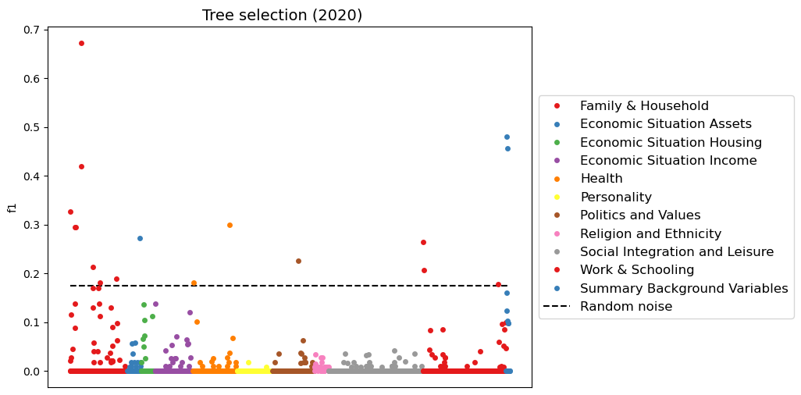
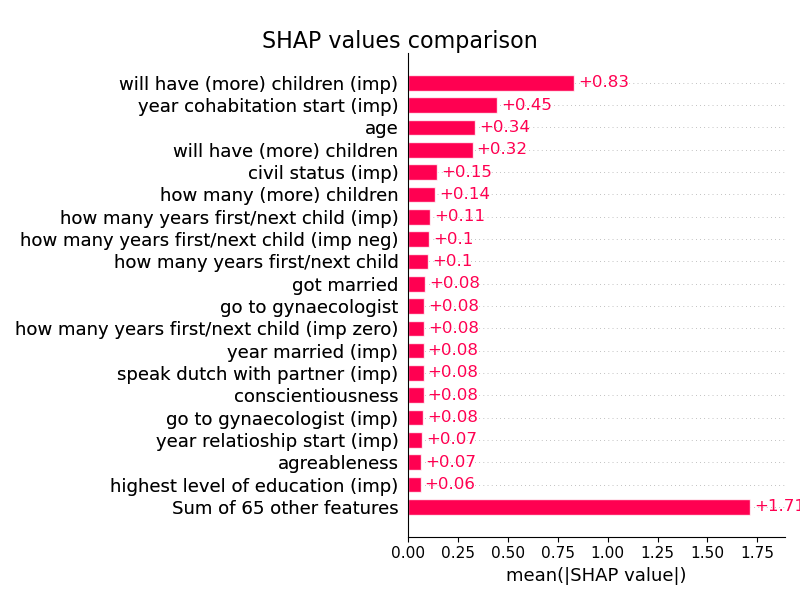

# ODISSEI 2024, PreFer data challenge
*Simone Meneghello, Alessio Piraccini, Gianluca Ivo Tori*

---

## Initial considerations

- **Recent data priority**: Key insights for predicting fertility (2021-2023) likely stem from surveys around 2021. Focus on recent surveys, supplemented by relevant past data.
  
- **Feature selection**: Despite numerous survey questions, only a few features may be crucial. Identifying and selecting these key features is essential to streamline the dataset.

- **Handling missing values**: Missing data might not be random and could hold valuable information. Some missing responses result from survey branching logic. Longitudinal data may allow filling gaps with past information.

- **Key predictors**: Likely predictors include age, relationship status, economic situation, and existing children. However, the dataset's breadth may reveal unexpected patterns.

---

## Data exploration

- **Task Overview**: classify if a person will have a child within 2021-2023 using 2020 data.
  
- **Dataset Details**: 
  - Initial dataset: 6,418 rows, 31,634 columns.
  - Cleaned dataset: 987 rows, 25,868 columns (removed rows with missing outcomes and columns with all missing values).

- **Background Dataset**: 
  - Longitudinal format with repeated entries per subject across years.
  - Filtered to include subjects with available outcomes.
  - Contains key predictive features (e.g., age, income, civil status).

---

## Tree selection

- Used a univariate decision tree with stratified 5-fold cross-validation for feature evaluation.
- Performance decreases over time, supporting the *relevance of recent surveys*.

---

## Tree selection

- Most surveys show limited key variables.
- Key variables are desire for children, income, age, civil status, gynecologist visits

---

## Missing values

**Key considerations**:
- missing data can often be attributed to *survey logic* or *non-participation*
- missing data in key variables, like *future child plans*, often correlates with not having a child

We used a **longitudinal** approach for imputation, filling gaps with the most recent past responses.
 

| quest2015   | quest2016   | quest2017   | quest2018   | quest2019   | quest2020   | quest2020_imp       |
|-------------|-------------|-------------|-------------|-------------|-------------|----------------------|
| 4         |     --      | 4           |       --    | 5           | 5         | 5                  |
|        --   |     --      | 5           |       3     |        --   |        --   | 3                    |
| 2           |     --      |        --   |       --    |         --  |       --    | 2                    |

---

## Exploratory data analysis

- *Propensity to have a child* is the strongest predictor.
- Income, relationship status, and Big Five traits are significant.

---

## Exploratory data analysis

---

## Exploratory data analysis

- Immediate plans for children and desire for children correlate with having children.
- Recent cohabitation and individuals in their thirties are more likely to have children.
- Mostly married or never married have children.
- Income shows no clear difference between groups.

---

## Modeling

- Used stratified shuffle split (k=10, 30% validation) for validation to improve test performance alignment.
- Focused on tree-based models: Random Forest, Extra Trees, and Gradient Boosting (CatBoost, LightGBM, XGBoost).
- Employed Bayesian hyperparameter tuning.
- Combined CatBoost, LightGBM, Extra Trees using weighted voting (CatBoost weight: 0.5).
- Final model: weighted voting of CatBoost, LightGBM, Extra Trees; CatBoost is the best standalone model.

---

## Modeling

- *Intention of having a child* and related features.
- *Relationship status*: start year of cohabitation, civil status, and marriage flag are significant.
- *Age* is the third most important feature.
- Additional predictors include *"Go to the gynecologist"* and *Big Five* personality traits (agreeableness, conscientiousness).

---

---

## Modeling

- Higher **SHAP values** for *individuals desiring children, especially older subjects*.
- Increased predicted probability for people in their thirties planning another child soon.
- Married individuals, particularly those marrying young, show higher predicted probabilities.
- Recent cohabitation (within ten years) and age 28-38 correlate with higher SHAP values.
- Visiting a gynecologist indicates a higher expected probability, supporting its role in identifying pregnant women.

---

## Final considerations

- Achieved **~90% accuracy** with the final model; sophisticated techniques offer slight performance improvements but aren't essential.
- Key predictors of fertility are intention to have a child and relationship status, as expected.
- Personality traits, analyzed via factor analysis, can enhance prediction accuracy.

---

## Appendix: Big five

- Focused on investigating how Big Five personality traits affect childbearing propensity.
- According to this model the personality traits are Extraversion, Agreeableness, Conscientiousness, Emotional Stability, and Openness; viewed as spectrums. It's based on factor analysis of psychometric data, validated across cultures.
- Survey questions are rated on a 5-point scale, missing values are imputed using previous year data due to trait stability.
- Used Factor Analysis on survey questions to obtain five traits to be used as features for the final model.

---

## Appendix: Big five

|    | Neuroticism                      | Extraversion                                      | Agreeableness                                     | Conscientiousness                                          | Openness                                          |
|----|----------------------------------|---------------------------------------------------|---------------------------------------------------|------------------------------------------------------------|---------------------------------------------------|
|    | (+) Get upset easily.            | (-) Keep in the background.                       | (+) Sympathize with others’ feelings.             | (+) Like order.                                            | (+) Have excellent ideas.                         |
|    | (+) Have frequent mood swings.   | (-) Am quiet around strangers.                    | (-) Am not really interested in others.           | (-) Often forget to put things back in their proper place. | (+) Am full of ideas.                             |
|    | (+) Get stressed out easily.     | (-) Don’t talk a lot.                             | (+) Am interested in people.                      | (-) Leave my belongings around.                            | (+) Have a rich vocabulary.                       |

---

# Thank you for your attention!
